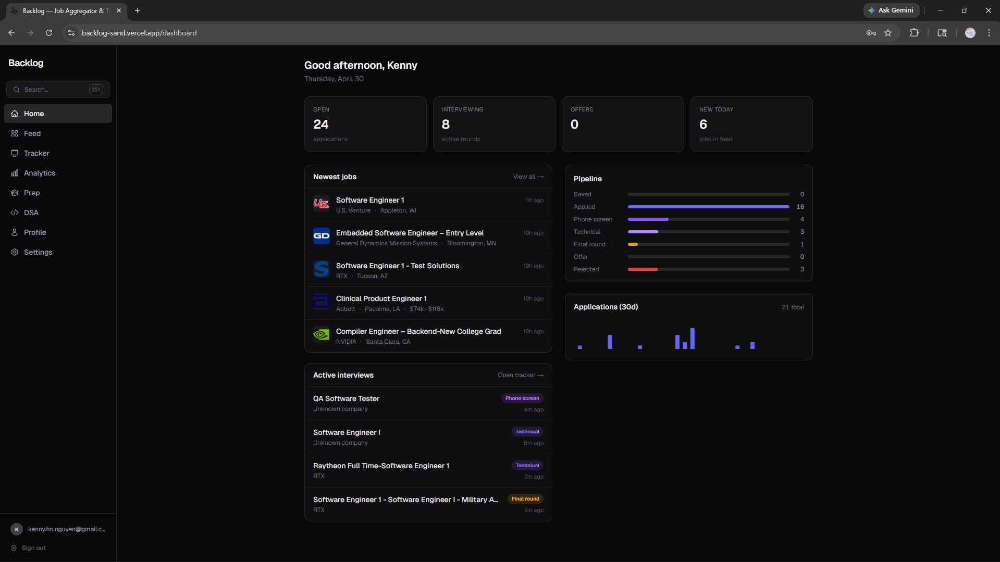
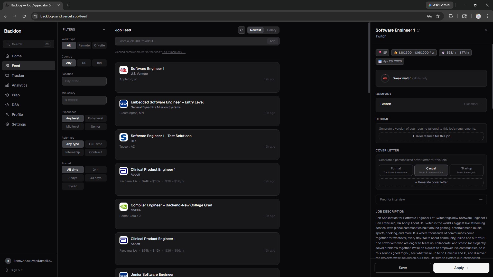
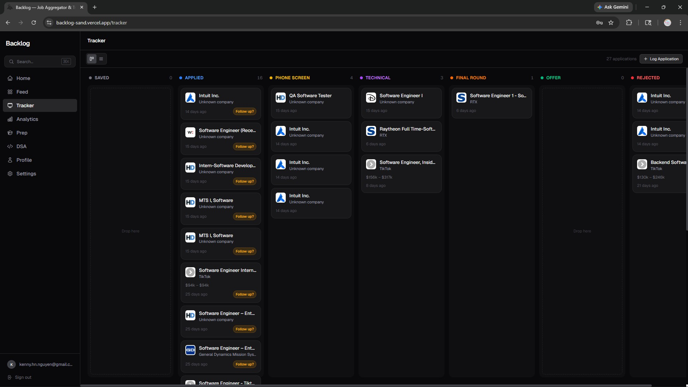
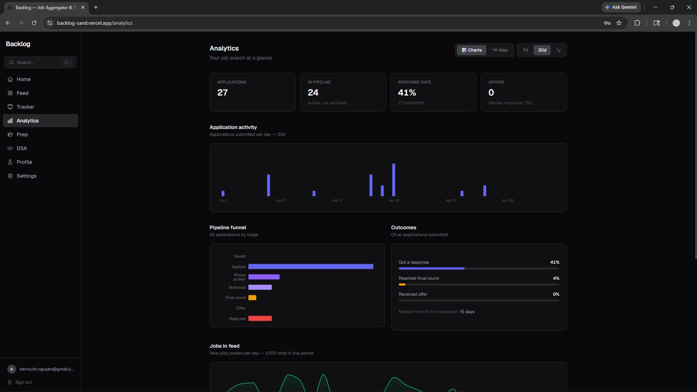
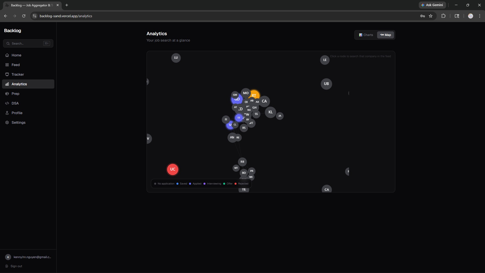
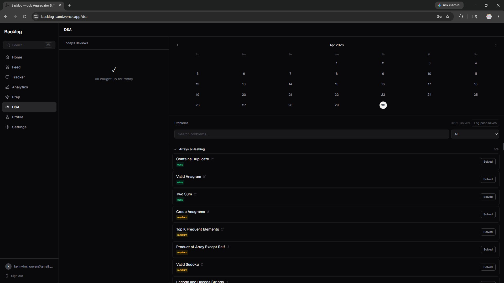
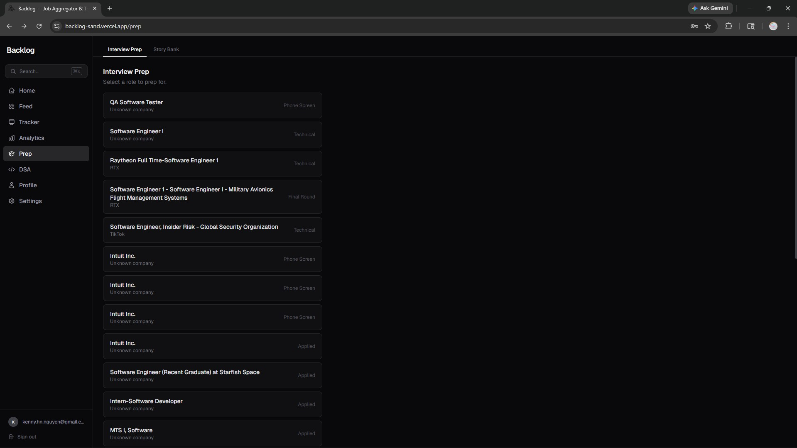
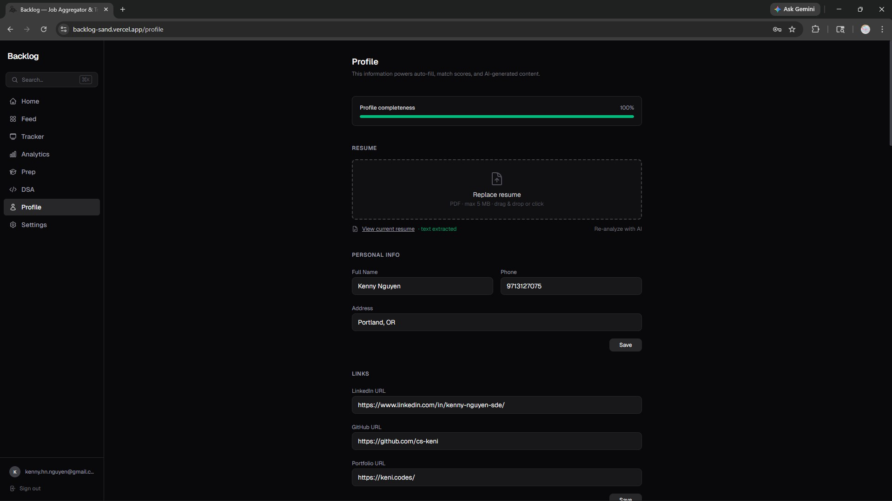
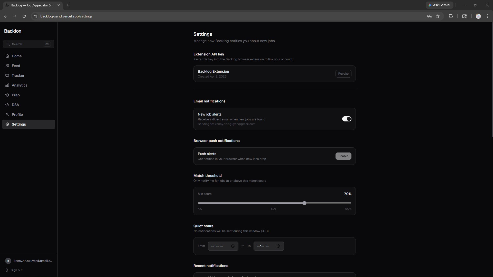

# Backlog

> A full-stack job search platform for new grad SWEs where applying within hours of posting is everything.

**Live:** [backlog-sand.vercel.app](https://backlog-sand.vercel.app)

---



---

## The problem

In SWE recruiting, applying within hours of a role being posted meaningfully increases response rates. Most people miss that window because they're manually checking five different sites. Backlog fixes this by aggregating new grad roles in real time from GitHub-maintained repos and 30+ company career portals, scoring them against your resume automatically, and tracking the full application pipeline from first glance to offer — with AI-powered resume tailoring, cover letter generation, and interview prep built in.

---

## Screenshots

| | |
|---|---|
|  |  |
| **Job Feed** — Real-time feed with filter sidebar (work type, country, location, salary, experience, role type, date range). Job detail panel shows AI match score, resume tailor, and cover letter generator with three tone templates. | **Tracker** — Drag-and-drop kanban across all 7 stages. Color-coded column headers, follow-up age nudges, and per-card company logos. Every drag writes a timeline row. |
|  |  |
| **Analytics** — Application activity bar chart, pipeline funnel, outcome rates, jobs-in-feed area chart, and median time-to-first-response — computed from real data. | **Company Map** — Force-directed graph where nodes are companies colored by your application status and edges connect companies sharing tech stack overlap (Jaccard ≥ 0.25). Clusters emerge naturally. |
|  |  |
| **DSA Tracker** — Spaced repetition for all 150 NeetCode problems. SM-2-inspired intervals, month-grid calendar, and bulk backfill for past solves. Built into the job search app so there's no context switching. | **Interview Prep** — Company-specific question banks generated by Claude Sonnet, STAR response builder with AI drafting, and a reusable Story Bank that cross-references questions by theme. |
|  |  |
| **Profile** — Structured profile covering everything an ATS form asks for: personal info, work history, education, projects, skills, EEO fields. 100% completeness drives max auto-fill accuracy and match score quality. | **Settings** — Extension API key management, email/push notification toggles, match threshold slider (set to 70% here), quiet hours, and notification log. |

---

## Core loop

```
1. New roles surface in real time from GitHub aggregation + 30+ portal scans
2. AI match scoring runs lazily against your resume — cached, invalidated on change
3. You get email/push alerts when a high-match role drops (threshold + quiet hours respected)
4. One click generates a tailored resume and cover letter for the specific role
5. Browser extension auto-fills the ATS form — deterministic for standard fields, LLM for the rest
6. Status updates flow back to the tracker; every transition logged to the timeline
7. Prep tab surfaces company questions, STAR builder, and your story bank before each interview
8. Analytics tracks response rates, funnel shape, and the company landscape over time
```

---

## Features

### Live Job Feed
- Aggregates from SimplifyJobs/New-Grad-Positions (GitHub) and 30+ company Greenhouse/Lever portals
- Supabase Realtime subscriptions — new jobs appear without a page refresh
- AI match scoring (4 dimensions: role fit, tech stack, experience, compensation) — lazy, cached, stale-on-resume-change
- "Just posted" badge on roles under 3 hours old
- "Add Job from URL" — paste any link; Backlog hits the Greenhouse/Lever public API for structured data, falls back to HTML fetch + GPT-5 nano for other pages
- Deterministic relevance filter runs before normalization: drops PhD-required, non-US, non-eng, and over-leveled roles before they burn LLM tokens

### Application Tracker
- Drag-and-drop kanban: `Saved → Applied → Phone Screen → Technical → Final Round → Offer / Rejected`
- Full status-change timeline per application (not just current status)
- Per-application rich-text notes (Tiptap), recruiter contacts, application URL, follow-up nudges
- "Log Application" modal with two modes: URL-first (auto-extract) or manual entry

### Profile & Resume
- Structured profile: personal info, work history, education, projects, skills, EEO & salary fields
- PDF resume upload → AI text extraction → review modal before any data is committed
- "Tailor resume for this job" — Claude Sonnet rewrites bullets aligned to the JD; stored as versioned PDFs; base resume is never overwritten
- Profile completeness indicator shows what's missing and what it unlocks

### Cover Letter Generator
- Triggered per job from the feed detail panel
- Claude Sonnet reads JD + company profile + resume → picks template → generates letter
- Three templates: Formal, Casual, Startup — model selects based on company tone; user can override
- Inline editor, copy to clipboard, download as PDF

### Company Intelligence & Interview Prep
- Company panel on every job: enriched description, headcount estimate, funding stage, tech stack chips, Glassdoor search link
- Company question bank — lazily generated by Claude on first Prep tab open, cached
- STAR response builder: Claude drafts from your profile + work history; you edit and save
- Story Bank: company-agnostic narratives with STAR+Reflection structure, cross-referenced to questions by theme

### Analytics
- Application activity bar chart (7d / 30d / 1y)
- Pipeline funnel from `application_timeline`
- Response rate, outcome breakdown, median time-to-first-response
- Jobs-in-feed area chart — volume over time
- Company Map: force-directed graph (react-force-graph-2d) with tech-stack-based edges; click a node to filter the feed

### DSA Spaced Repetition Tracker
- All 150 NeetCode problems, grouped by pattern (Arrays & Hashing, Trees, Graphs, DP, etc.)
- SM-2-inspired intervals: same day → +1 → +3 → +7 → +14 days
- Month-grid calendar (vanilla Tailwind, no library) showing upcoming review load
- Bulk backfill: multi-select past problems with a custom past date; skips review dates already in the past
- Re-solving resets the chain; confirmation prompt before overwrite

### Browser Extension (Chrome MV3)
- Authenticates via a user-scoped API key generated in Settings
- **Hybrid fill strategy:** regex FIELD_MAP handles ~80% of standard fields instantly (zero API cost); Claude Haiku fills remaining unfilled fields in a single batched call (~$0.0001/page); Claude Sonnet handles open-ended questions (checks `saved_answers` first)
- Multi-page navigation: tracks fill state in `chrome.storage.session` across page transitions (survives MV3 service worker restarts)
- "Add to Backlog" button on any job posting page — extracts JD from the rendered page, solves JS-rendered sites
- On submission, marks the application as Applied in the tracker automatically

### Notifications
- Email alerts via Resend, browser push via Web Push API, match threshold and quiet hours configurable
- Dispatcher deduplicates via `notification_log` before every send
- Discord job feed with Jaccard-based relevance sorting and deep links that open the job drawer directly after login

---

## Tech Stack

| Layer | Choice |
|---|---|
| Frontend | Next.js 16 (App Router), TypeScript |
| Styling | Tailwind CSS |
| Animations | Framer Motion — spring physics, staggered entrances, drag |
| Drag & Drop | @dnd-kit/core |
| Rich Text | Tiptap (ProseMirror JSON stored as `jsonb`) |
| Command Palette | cmdk |
| Charts | Recharts, react-force-graph-2d |
| Database | Supabase (PostgreSQL + Auth + Realtime) |
| Aggregation Worker | Node.js on Render — 15-min cron |
| LLM — High Frequency | GPT-5 nano — normalization, match scoring, question generation |
| LLM — Quality | Claude Sonnet 4.6 — resume tailoring, cover letters, STAR, interview guides |
| LLM — Speed | Claude Haiku — extension unfilled-field analysis (batched, ~500ms) |
| Browser Extension | Chrome MV3 |
| Notifications | Resend (email), Web Push API, service worker |
| Hosting | Vercel (app) + Render (worker) |
| Testing | Vitest + MSW + Playwright |

---

## Architecture

```
┌─────────────────────────────────────────────┐
│              Next.js (Vercel)                │
│  Feed · Tracker · Analytics · Prep · DSA    │
│  Profile · Cover letters · Resume tailoring  │
└───────────────┬─────────────────────────────┘
                │ Supabase SDK + API Routes
┌───────────────▼─────────────────────────────┐
│           Supabase (PostgreSQL)              │
│  jobs · applications · application_timeline  │
│  users · resume_versions · cover_letters     │
│  company_profiles · match_scores             │
│  star_responses · story_bank · lc_solves     │
│  push_subscriptions · api_keys               │
└───────────────▲─────────────────────────────┘
                │ writes via service role key
┌───────────────┴─────────────────────────────┐
│         Aggregation Worker (Render)          │
│  GitHub API → HTML parser → GPT-5 nano      │
│  Greenhouse + Lever portal scan (30+ cos.)  │
│  Relevance filter → dedup → normalize       │
│  Company stub upsert → Discord notify       │
└─────────────────────────────────────────────┘
```

---

## Key Engineering Details

**Aggregation pipeline** — Polls SimplifyJobs for new commits using the GitHub API, parses the HTML `<table>` README format (handles `↳` sub-rows, locked entries, multi-location `<br>` cells), and concurrently scans 30+ Greenhouse/Lever portals. A deterministic relevance filter (zero LLM cost) drops PhD-required, non-US, non-eng, and over-leveled roles before normalization. GPT-5 nano normalizes in batches of 20. URL deduplication runs on a UNIQUE constraint — never burns tokens on already-stored jobs.

**Match scoring** — 4-dimension breakdown (role fit, tech stack, experience level, compensation) computed lazily on first view. Cached in `match_scores` with `is_stale` invalidated on resume upload or manual skill changes. Jaccard proxy over `jobs.tags` vs `users.skills` used for free, sub-millisecond pre-sort in Discord notifications.

**Browser extension** — Hybrid fill strategy: regex FIELD_MAP handles ~80% of standard fields instantly. Remaining unfilled fields sent to a single Claude Haiku batch call. Open-ended prompts check `saved_answers` first, then escalate to Sonnet. Page state persists across MV3 service worker restarts via `chrome.storage.session`. Multi-page fill history accumulated in session storage and shown in the final review panel grouped by page.

**Company graph** — Nodes sized by open role count, colored by application status (grey → blue → yellow → orange → green/red). Edges where Jaccard similarity on `jobs.tags[]` ≥ 0.25. Canvas renderer via react-force-graph-2d. Click a node to filter the feed to that company.

**DSA tracker** — Static NeetCode 150 problem list (no DB table needed). Solve dates stored as ISO date strings from the client to avoid UTC drift. Re-solving atomically deletes pending reviews and inserts a fresh 5-review chain. Bulk backfill skips review dates already in the past.

---

## Development

```bash
git clone https://github.com/cs-keni/backlog.git
cd backlog
npm install
cp .env.example .env.local   # fill in Supabase, OpenAI, Anthropic keys
npm run dev
```

### Required env vars

```
NEXT_PUBLIC_SUPABASE_URL
NEXT_PUBLIC_SUPABASE_ANON_KEY
SUPABASE_SERVICE_ROLE_KEY
OPENAI_API_KEY
ANTHROPIC_API_KEY
NEXT_PUBLIC_APP_URL
```

Optional (notifications, extension, Discord):
```
RESEND_API_KEY
VAPID_PUBLIC_KEY / VAPID_PRIVATE_KEY / VAPID_SUBJECT
TWILIO_ACCOUNT_SID / TWILIO_AUTH_TOKEN / TWILIO_PHONE_NUMBER
DISCORD_WEBHOOK_URL
GITHUB_TOKEN
```

Access is closed by default — provision accounts directly in Supabase.

---

## Roadmap

See [PHASES.md](./PHASES.md) for the full phase-by-phase development log.
